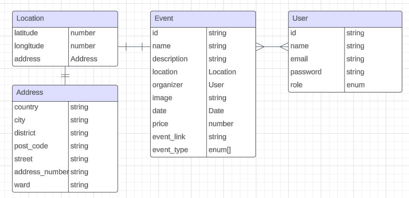

# My Events - Events Application Backend


## Repository Description

This repository contains the server for the event application contributed by Andrei, Viktoriia and Binh. It will offer core functionality concepts for a typical Event Application.

## Table of Contents

- [Getting Started](#getting-started)
- [Libraries](#libraries)
- [Third party API](#third-party-api)
- [Database Schema and ERD](#database-schema-and-erd)
- [Folder structure](#folder-structure)
- [API Endpoints](#api-endpoints)

## Getting Started

This section provides instructions on how to set up your environment and get the project up and running on your local machine for development and testing purposes.

### Prerequisites

Before you begin, ensure you have the following installed:

**Node**: `version ^18`
**TypeScript**: `version ^5`

1. Open your terminal and clone the back-end repository with the following command:

```
git clone https://github.com/AndreiSorokin/myEvents.git
```

2. Navigate to the root folder of back-end directory.

```
  cd MyEvents
```

3. Set up your local environment by creating a file `.env` with these values, replace them with your own API info:

```
PORT=3003
MONGO_DB_URL=[YOUR_DB_CONNECTION_STRING]
JWT_SECRET=D0hf7Dv1XOOk2I9ElcG6ItellMzeNAQN
JWT_EXPIRATION=1h
CLOUDINARY_CLOUD_NAME=[YOUR_CLOUDINARY_NAME]
CLOUDINARY_API_KEY=[YOUR_CLOUDINARY_API_KEY]
CLOUDINARY_API_SECRET=[YOUR_CLOUDINARY_API_SECRET]
```

4. Install the necessary dependencies:

```
npm install
```

5. To start the project locally:

```
npm start
```

6. To start the project in development mode

```
npm run dev
```

## Libraries

| Library                | Purpose                                                                                                     |
| ---------------------- | ----------------------------------------------------------------------------------------------------------- |
| **bcrypt**       | Library for hashing and comparing passwords securely.                                                       |
| **cloudinary**   | A service to manage images and videos in the cloud, used for uploading and manipulating media files.        |
| **cors**         | Enables Cross-Origin Resource Sharing (CORS) for handling requests from different origins.                  |
| **dotenv**       | Loads environment variables from a `.env` file into `process.env`.                                      |
| **express**      | Fast, unopinionated web framework for building RESTful APIs in Node.js.                                     |
| **jsonwebtoken** | Used to create and verify JSON Web Tokens (JWT) for authentication purposes.                                |
| **mongoose**     | ODM (Object Data Modeling) library for MongoDB and Node.js, helps in managing MongoDB schemas and queries. |
| **multer**       | Middleware for handling `multipart/form-data`, used primarily for file uploads.                           |
| **nodemailer**   | Library for sending emails from Node.js applications.                                                       |
| **nodemon**      | Tool that automatically restarts the Node.js application when file changes in the directory are detected.   |
| **passport**     | Authentication middleware for Node.js, supports various authentication methods (local, OAuth, etc.).        |
| **uuid**         | Generates universally unique identifiers (UUIDs).                                                           |
| **Sinon**        | For stubbing and mocking (test)                                                                             |
| **Jest**         | JavaScript Testing Framework                                                                                |
| **Supertest**    | Testing HTTP endpoints                                                                                      |
| **axios**        | Library for integrating with third party APIs                                                               |
|                        |                                                                                                             |

## Third party API

| API      | Purpose                                                                      | Info                               |
| -------- | ---------------------------------------------------------------------------- | ---------------------------------- |
| OpenCage | Converts geographic coordinates into human-readable addresses and vice versa | [OpenCage](https://opencagedata.com/) |
|          |                                                                              |                                    |

## Database Schema and ERD


_Entity–relationship model Diagram_

## Folder Structure

This project is organized into various folders and files for better modularity and maintainability. Below is an explanation of each directory and its purpose:

```
├── .github/               # GitHub configuration and workflows
├── erd/                   # Entity Relationship Diagrams (ERDs) for database modeling
├── https/                 # Contains .rest file for manual API testing
├── src/                   # Source code for the application
│   ├── __tests__          # Unit and integration tests
│   ├── config/            # For custom configuration
│   ├── controllers/       # For request handling and response logic.
│   ├── enums/             # For custom database schema enum units.
│   ├── errors/            # For custom error handling.
│   ├── interfaces/        # For object's interfaces.
│   ├── middleware/        # For custom middleware configuration.
│   ├── models/            # For Mongoose models or database schema definitions
│   ├── routes/            # Express route definitions for various endpoints
│   ├── services/          # Business logic and service layer for the app
│   ├── app.ts             # Main application configuration and Express setup
│   └── server.ts          # Entry point of the application (starting the server)
├── .env                   # Environment variables
├── .gitignore             # For excluding specific files/folders from Git
├── package.json           # Contains project metadata and dependency information
├── README.md              # Project documentation (this file)
├── tsconfig.json          # TypeScript configuration file
```

## API Endpoints
